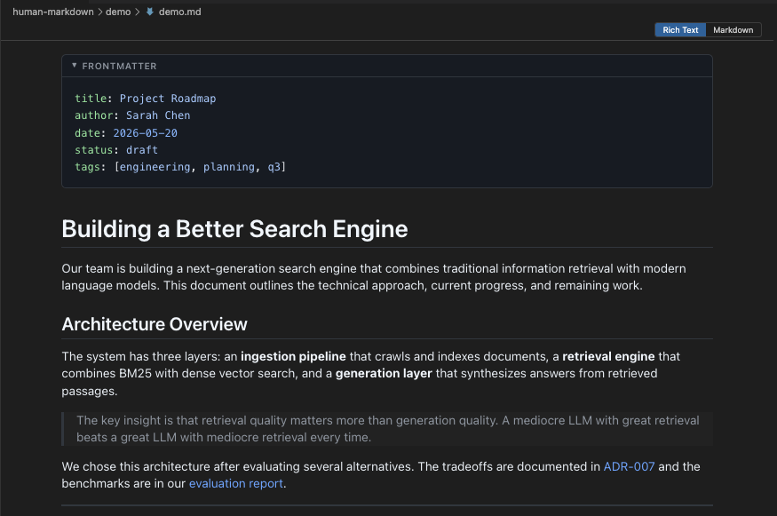
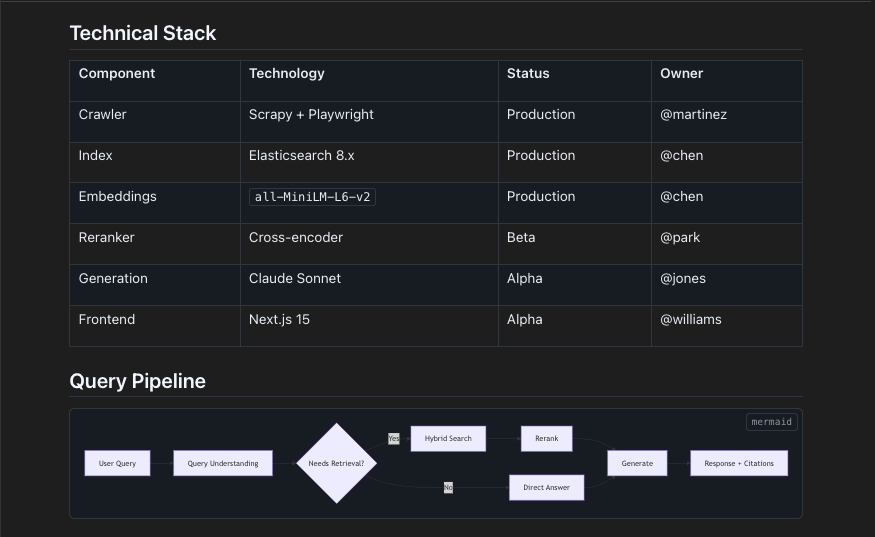
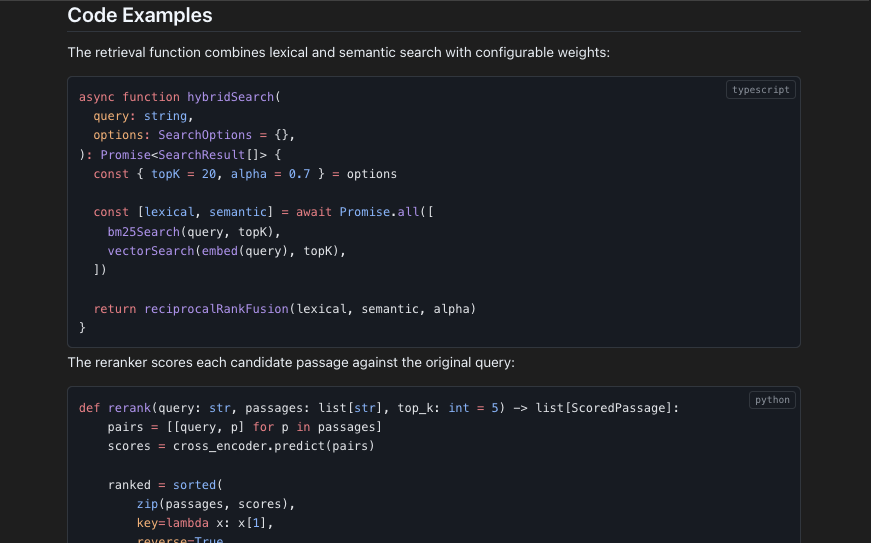
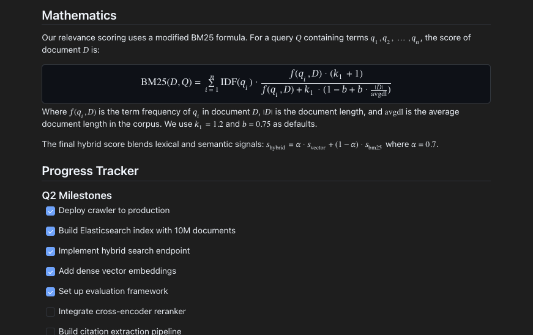
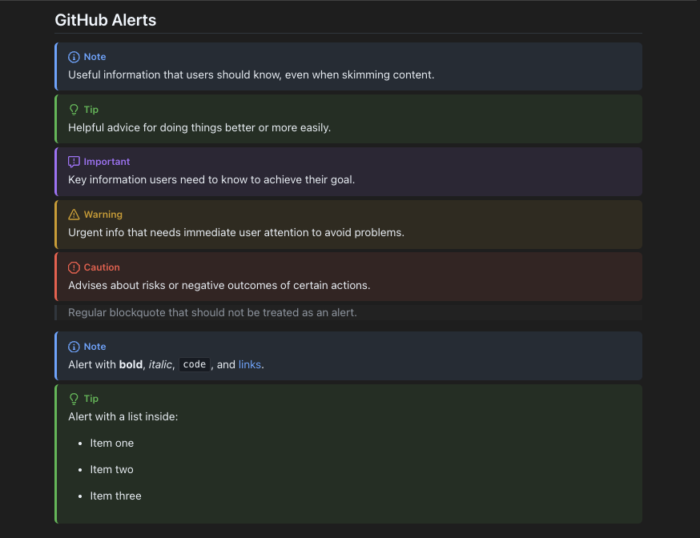

# Human Markdown

A WYSIWYG markdown editor for VSCode. Open any `.md` file, read it rendered, edit it inline. Toggle to raw with one keystroke.

AI writes the markdown. Human Markdown makes it something you can actually read and work with.

## Features

### Rich Text Editing

Click into any block and edit directly in the rendered view. Headings, paragraphs, lists, blockquotes, images, links — all editable in place. No preview pane, no split view. Just the document. Use keyboard shortcuts or the formatting toolbar to apply bold, italic, headings, lists, and more.

### Frontmatter Cards

YAML frontmatter renders as a collapsible card with syntax highlighting. Click to expand and edit; collapse to get it out of the way.

### Tables and Diagrams

GFM tables render as styled grids. Mermaid diagrams render inline — flowcharts, sequence diagrams, entity relationships, and more. The Mermaid renderer lazy-loads only when your document contains a mermaid block.

### Syntax-Highlighted Code Blocks

Code blocks render with full syntax highlighting powered by Shiki. Language label in the corner. Click to edit the raw code. Supports every language Shiki supports.

### Math Rendering

Inline math (`$...$`) and display math (`$$...$$`) render via KaTeX. Like Mermaid, KaTeX lazy-loads only when your document uses math syntax.

### GitHub Alerts

`> [!NOTE]`, `> [!TIP]`, `> [!IMPORTANT]`, `> [!WARNING]`, and `> [!CAUTION]` render as styled blocks with icons and colored borders — matching GitHub's alert styling. Supports rich content inside alerts including lists, code, and formatting.

### Task Lists

GFM task lists render as interactive checkboxes. Click to toggle — the underlying markdown updates automatically.

### One-Keystroke Mode Toggle

`Cmd+Shift+V` (or `Ctrl+Shift+V`) flips between the rendered editor and raw markdown. Same tab, no context switch. Or use the Rich Text / Markdown buttons in the toolbar.

### Find in Document

`Cmd+F` searches rendered content in WYSIWYG mode and raw text in markdown mode.

### Built-in Themes

Light, Dark, and GitHub themes. Auto mode matches your VSCode color scheme. All rendering — alerts, code blocks, tables, frontmatter — adapts to the active theme.

### Round-Trip Fidelity

Your formatting stays intact. Indent style, heading style, list markers, emphasis style, blank lines — preserved through edits. What you wrote is what you get back.

### Fast

Opens in under 200ms. Mode toggle under 100ms. Heavy renderers (Mermaid, KaTeX) lazy-load only when needed. Webview bundle under 500KB gzipped.

## Usage

1. Open any `.md` file
2. Right-click the editor tab → "Reopen Editor With..." → "Human Markdown"
3. Or set as default: `"workbench.editorAssociations": { "*.md": "humanMarkdown.preview" }`

### Commands

| Command | Shortcut | Description |
|---------|----------|-------------|
| Human Markdown: Toggle WYSIWYG / Raw | `Cmd+Shift+V` | Switch between rendered and raw |
| Human Markdown: Find | `Cmd+F` | Search in the active mode |
| Human Markdown: Select Theme | — | Pick a theme from the palette |

### Keyboard Shortcuts

The editor supports standard formatting shortcuts in WYSIWYG mode. A formatting toolbar is also available for mouse-driven editing.

#### Inline Formatting

| Shortcut | Action |
|----------|--------|
| `Cmd/Ctrl+B` | Bold |
| `Cmd/Ctrl+I` | Italic |
| `Cmd/Ctrl+E` | Inline code |
| `Cmd/Ctrl+Alt+X` | Strikethrough |

#### Block Formatting

| Shortcut | Action |
|----------|--------|
| `Cmd/Ctrl+Alt+1` – `6` | Heading 1–6 |
| `Cmd/Ctrl+Alt+0` | Paragraph (clear heading) |
| `Cmd/Ctrl+Alt+8` | Bullet list |
| `Cmd/Ctrl+Alt+7` | Ordered list |
| `Cmd/Ctrl+Shift+B` | Blockquote |
| `Cmd/Ctrl+Alt+C` | Code block |

#### Lists

| Shortcut | Action |
|----------|--------|
| `Tab` | Indent list item |
| `Shift+Tab` | Outdent list item |
| `Enter` | New list item |
| `Enter` (empty item) | Exit list |

### Settings

| Setting | Default | Description |
|---------|---------|-------------|
| `humanMarkdown.theme` | `auto` | Theme: auto, light, dark, github |
| `humanMarkdown.defaultMode` | `wysiwyg` | Default mode when opening files |

## Requirements

- VSCode 1.85+

## Feedback & Issues

Found a bug or have a feature request? Email [support@purecontext.dev](mailto:support@purecontext.dev).
