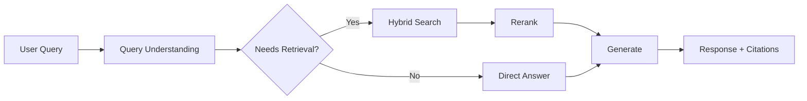

# Building a Better Search Engine&#x20;

Our team is building a next-generation search engine that combines traditional information retrieval with modern language models. This document outlines the technical approach, current progress, and remaining work.

## Architecture Overview

The system has three layers: an **ingestion pipeline** that crawls and indexes documents, a **retrieval engine** that combines BM25 with dense vector search, and a **generation layer** that synthesizes answers from retrieved passages.

> The key insight is that retrieval quality matters more than generation quality. A mediocre LLM with great retrieval beats a great LLM with mediocre retrieval every time.

We chose this architecture after evaluating several alternatives. The tradeoffs are documented in [ADR-007](./decisions/adr-007.md) and the benchmarks are in our [evaluation report](./benchmarks/eval-q2.md).

---

## Technical Stack

| Component  | Technology          | Status     | Owner     |
| ---------- | ------------------- | ---------- | --------- |
| Crawler    | Scrapy + Playwright | Production | @martinez |
| Index      | Elasticsearch 8.x   | Production | @chen     |
| Embeddings | `all-MiniLM-L6-v2`  | Production | @chen     |
| Reranker   | Cross-encoder       | Beta       | @park     |
| Generation | Claude Sonnet       | Alpha      | @jones    |
| Frontend   | Next.js 15          | Alpha      | @williams |

## Query Pipeline



## Code Examples

The retrieval function combines lexical and semantic search with configurable weights:

```typescript
async function hybridSearch(
  query: string,
  options: SearchOptions = {},
): Promise<SearchResult[]> {
  const { topK = 20, alpha = 0.7 } = options

  const [lexical, semantic] = await Promise.all([
    bm25Search(query, topK),
    vectorSearch(embed(query), topK),
  ])

  return reciprocalRankFusion(lexical, semantic, alpha)
}
```

The reranker scores each candidate passage against the original query:

```python
def rerank(query: str, passages: list[str], top_k: int = 5) -> list[ScoredPassage]:
    pairs = [[query, p] for p in passages]
    scores = cross_encoder.predict(pairs)

    ranked = sorted(
        zip(passages, scores),
        key=lambda x: x[1],
        reverse=True
    )
    return [ScoredPassage(text=p, score=s) for p, s in ranked[:top_k]]
```

Configuration lives in `search.config.yaml`:

```yaml
retrieval:
  bm25_weight: 0.3
  vector_weight: 0.7
  top_k: 20

reranking:
  model: cross-encoder/ms-marco-MiniLM-L-12-v2
  top_k: 5
  batch_size: 32

generation:
  model: claude-sonnet-4-6
  max_tokens: 1024
  temperature: 0.2
```

## Mathematics

Our relevance scoring uses a modified BM25 formula. For a query $Q$ containing terms $q_1, q_2, \ldots, q_n$, the score of document $D$ is:

$$
\text{BM25}(D, Q) = \sum_{i=1}^{n} \text{IDF}(q_i) \cdot \frac{f(q_i, D) \cdot (k_1 + 1)}{f(q_i, D) + k_1 \cdot \left(1 - b + b \cdot \frac{|D|}{\text{avgdl}}\right)}
$$

Where $f(q_i, D)$ is the term frequency of $q_i$ in document $D$, $|D|$ is the document length, and $\text{avgdl}$ is the average document length in the corpus. We use $k_1 = 1.2$ and $b = 0.75$ as defaults.

The final hybrid score blends lexical and semantic signals: $s_{\text{hybrid}} = \alpha \cdot s_{\text{vector}} + (1 - \alpha) \cdot s_{\text{bm25}}$ where $\alpha = 0.7$.

## Progress Tracker

### Q2 Milestones

- [x] Deploy crawler to production
- [x] Build Elasticsearch index with 10M documents
- [x] Implement hybrid search endpoint
- [x] Add dense vector embeddings
- [x] Set up evaluation framework
- [ ] Integrate cross-encoder reranker
- [ ] Build citation extraction pipeline
- [ ] Launch internal alpha with 50 users

### Known Issues

1. **Latency spikes on long queries** — queries over 256 tokens cause the embedding model to batch inefficiently. Workaround: truncate to 128 tokens. Fix planned for v0.4.
2. **Stale index for real-time sources** — the crawler runs on a 6-hour cycle. News queries can return outdated results.
3. **Citation hallucination** — the generation layer occasionally attributes statements to the wrong source passage. Reranker integration should reduce this.

## Evaluation Results

We benchmark against MS MARCO and Natural Questions:

- **MRR\@10**: 0.38 (target: 0.40)
- **NDCG\@10**: 0.45 (target: 0.48)
- **Recall\@100**: 0.92 (target: 0.95)
- **P95 latency**: 220ms (target: <200ms)

## Team Notes

The generation layer is the most experimental part of the stack. We're currently evaluating three approaches:

1. Extractive summarization — pull verbatim spans from retrieved passages
   - Pro: zero hallucination risk
   - Con: answers feel robotic and fragmented
2. Abstractive generation with citations — synthesize a natural answer and link claims to sources
   - Pro: best user experience
   - Con: citation accuracy is \~85%, needs reranker to improve
3. Hybrid — extractive for factual queries, abstractive for explanatory ones
   - Pro: best of both worlds
   - Con: need a reliable query classifier

> **Decision needed**: We should pick one approach by June 1 and commit. The hybrid option is tempting but adds classifier complexity. Leaning toward option 2 with strict citation validation.

## Next Steps

Ship the reranker integration this week, then run a full eval pass. If MRR improves to 0.40+, we greenlight the internal alpha. Target launch: **June 15**.
